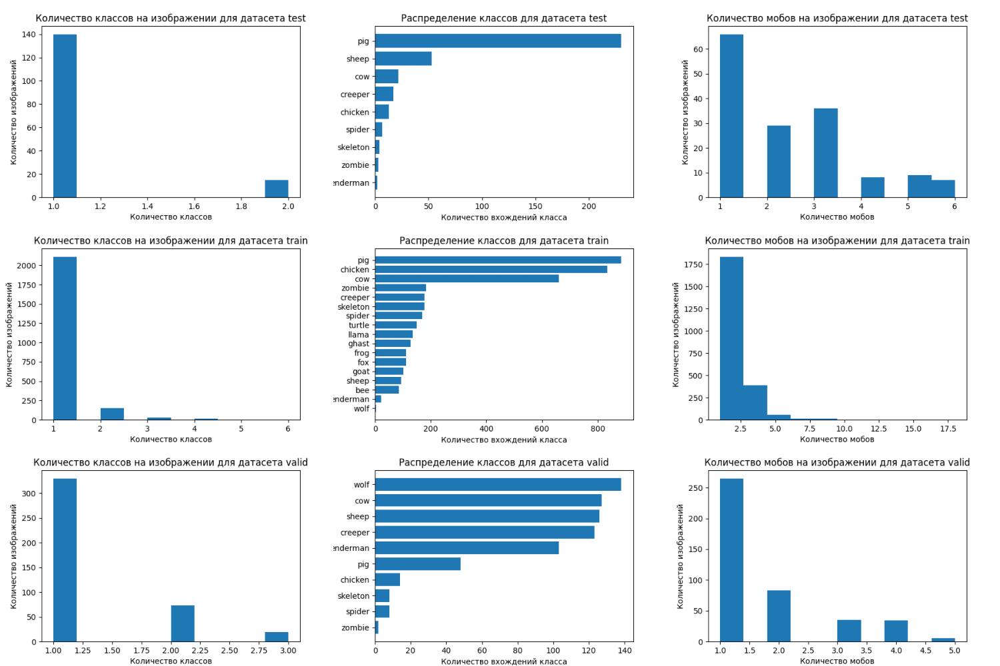
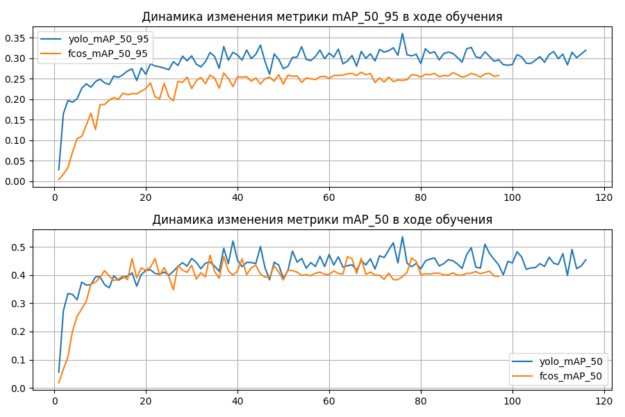
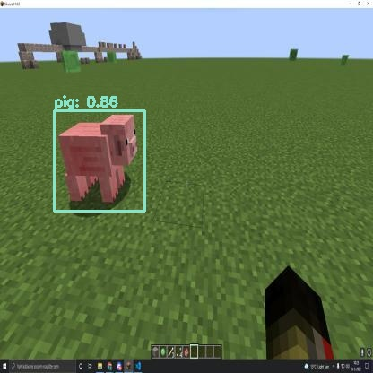
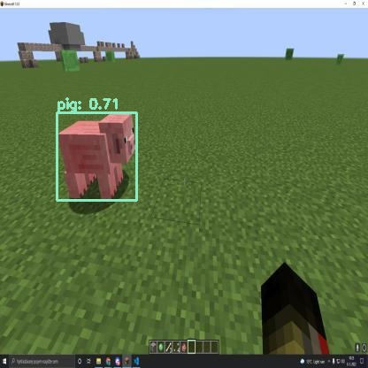
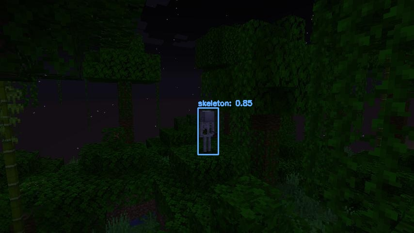
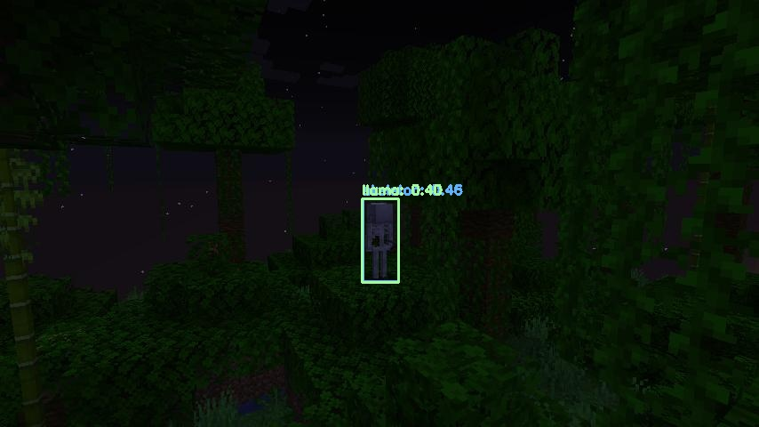
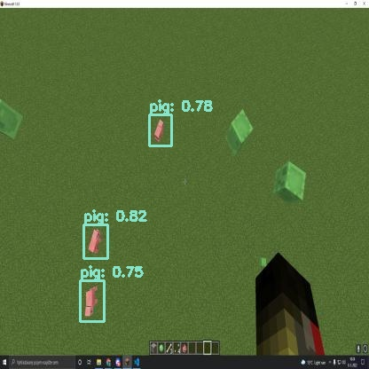
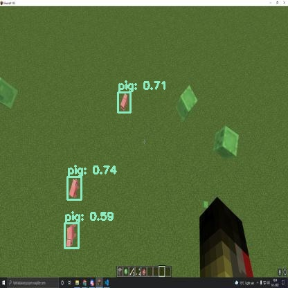
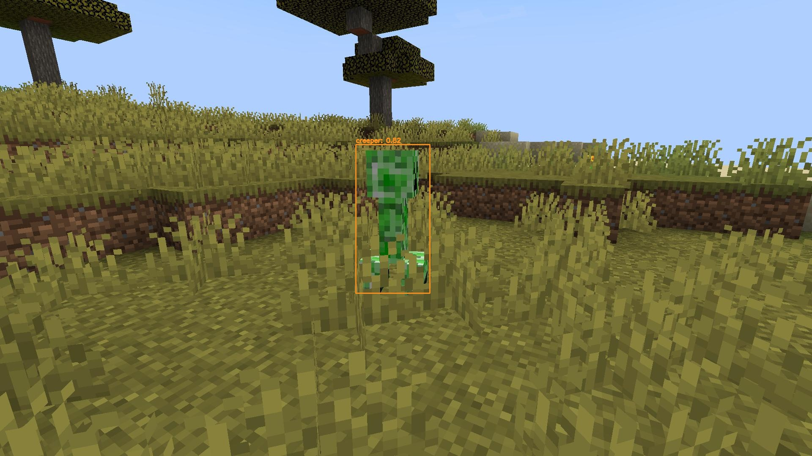

# Проект по сканированию кубического мира.

## Описание проекта.

Проекте направлен на исследование возможности современных моделей детекции объектов на примере игрового мира Minecraft. В ходе проекта были дообучены детекторы FCOS и YOLOv8s на специфическом игровом датасете и были сравнены их метрики и скорость прогноза. Краткий отчёт в формате .pdf можно [прочитать тут](artifacts/report.pdf).

## Структура проекта.
Проект имеет следующую структуру:

├── project.ipynb          **Ноутбук с EDA и обучением моделей**  
├── src/                   **Папка с .py скриптами и классами**  
├── mmdetection/           **Подмодуль mmdetection**  
├── data/                  **Датасеты**  
├── artifacts/             **Артефакты**  
│   ├── report.pdf         **PDF отчёт о работе**  
│   ├── metrics/           **Отчёты по метрикам**  
│   ├── inference/         **Примеры работы моделей**  
│   ├── datasets_info/     **Гарфики распределения данных в датасетах**  
│   ├── videos/            **Примеры работы моделей с видео**  
│   ├── fcos/              **Артефакты финального запуска модели FCOS**  
│   │   ├── examples/      **Примеры работы модели FCOS (в предобученном и обученном с нуля режиме)**  
│   ├── yolo8/examples/    **Примеры работы модели FCOS (в предобученном и обученном с нуля режиме)**  
├── runs/                  **Артефакты финального запуска модели YOLOv8s**  
├── ttf/                   **Папка со шрифтами для PDF отчёта**  

## Подготовка к запуску.
Установите окружение:

```bash
python -m venv .venv
```

Активируйте среду. 

Установите требуемые зависимости:

```bash
pip install -r requirements.txt
```

Установите mmcv при поомщи **mim**:

```bash
mim install mmcv==2.1.0
```

Для обучения FCOS используется mmdetection (необходимоскопировать его из репозитория https://github.com/open-mmlab/mmdetection.git затем перейти в соответствующую папку и установить).

```bash
cd mmdetection
pip install -v -e . --no-build-isolation 
```

После установки скопировать содержимое папки files_for_replace/mmdetection в mmdetection

Окружение готово к запуску.

## Этапы работы
### EDA
На данном этапе был проведён анализ данных, верификация и визуализация разметки. Разметка сделана корректно, но в данных наблюдается сильный дисбаланс классов. При этом в каждом из трёх датасетов (train / valid / test) разные классы являются мажоритарными. Ниже приведены графики с информацией о данных в соответствующих разрезах.



### Формирование и проверка первичных гипотез
На данном этапе были формулированы гипотезы какие модели и как обучать, использовать ли аугментацию при обучении. Поскольку это были стартовые гипотезы, то мы делали всего 70 эпох обучения и получилис следующие результаты:

## Моделирование
При обучении были рассмотрены две модели FCOS и YOLO. FCOS обучалась при помощи mmdetection, модель научилась достаточно уверено рисовать рамки, но качество классификации иногда хромало. Из YOLO моделей была выбрана YOLOv8 она показла значительно более лучший результат как по качеству отображения bounding box так и по классификации, кроме того она показала более высокую fps на инференсе. В таблице ниже при ведено сравнение двух моделей, а также приведены графики хода обучения.

| Наименование метрики | YOLO | FCOS | 
| :---------------------- | :---------------------- | :---------------------- |
| map_50 | 0.786 | 0.7436 | 
| map_50_95 | 0.5134 | 0.4502 | 
| fps | 78.14 | 33.99 | 



## Инференс

В заключении был проведён инференс на тестовом датасете и на коротком видео, результаты представлены в папке [artifacts](business_up). Примеры работы каждой из моделей приедставлены ниже

| YOLO | FCOS | 
| :---------------------- | :---------------------- |
|  |  | 
|  |  | 
|  |  | 
|  |  | 

Как видим обе модели неплохо справляются с поставленной задачей, но YOLO делает это немного лучше.
