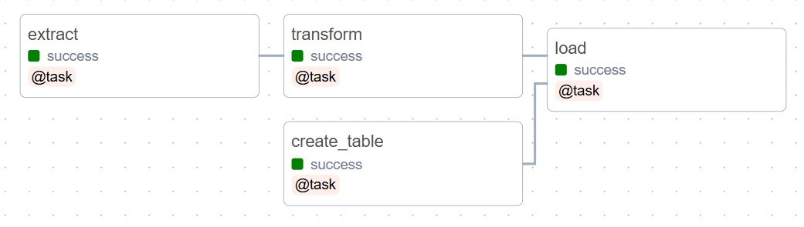
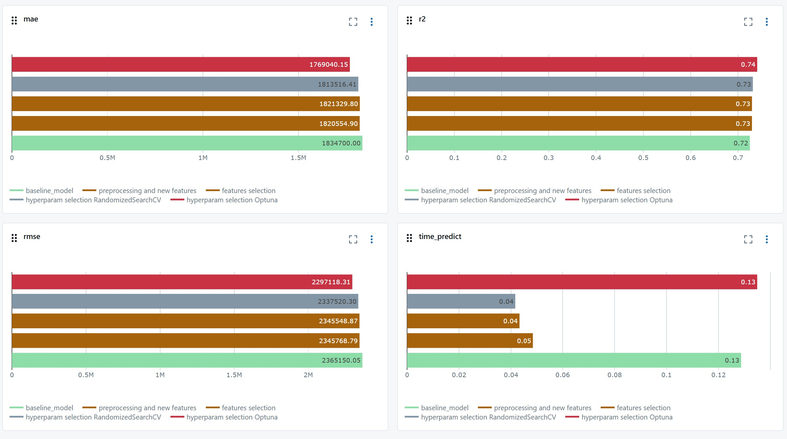

# Прогнозирование стоимости квартиры по данным Яндекс недвижимости.

Целью данного проекта было создание модели для прогнозирования стоимости квартиры в Москве на основании исторических данных. Проект состоит из следующих частей:
- получение и трансформация данных с их сохранением в БД с использованием Airflow;
- создание DVC-пайплайна для обучения модели;
- улучшение качества модели и её логирование в Mlflow.

## Структура проекта и установка зависимостей

В корнево директории проекта расположены следующие поддиректории:
- **airflow** - содержит файлы необходимые для запуска ETL-пайпалайна для получения, трансформации и загрузки сырых данных, а также сам даг для данного ETL;
- **dvc** - содержит DVC-пайпалайн для обучения модели, а также все файлы конфигурации для данного пайпалайна;
- **model_improvement** - содержит ноутбук с основным исследованием и улучшением модели с логированием в Mlflow.

Также в корневой директории находятся bash скрипты для запуска сервисов и файл с зависимостями requirements.txt. Для установки зависимостей в окружение необходимо воспользоваться командой.

```bash
pip install -r requirements.txt
```

Рассмотрим более подробно каждую часть проекта.

## Airflow

Перед запуском Airflow необходимо получить AIRFLOW_UID и вставить её в файл .env для этого выполнить команду:

```bash
echo -e "\nAIRFLOW_UID=$(id -u)" 
```

После этого необходимо провести инициализацию и первичный запуск Airflow при помощи скрипта:

```bash
sh init_airflow.sh
```

В дальнейшем Airflow можно будет поднимать из папки airflow поднимая docker-compose.

Сервис airflow поднимется на порту 8080. Логин и пароль по умолчанию airflow.
После запуска сервиса необходимо будет указать параметры подключения к базе данных для этого нужно перейти в Admin / Connection и создать новое подключение Postgres с именем destination_db. После этого даг можно будет запустить. Даг имеет следующую структуру:



## DVC

Если необходимо провести первичную инициализацию пайплайна, то необходимо убедиться, что отсутствует папка dvc/.dvc, в противном случае её необходимо удалить. Иначе может возникнуть конфликт при инициализации репозитория.

Инициализировать репозиторий можно командой:

```bash
sh init_dvc.sh
```

После этого необходимо перейти в директорию dvc

```bash
cd dvc
```

проверить корректно ли прописалось удалённое хранилище

```bash
dvc remote list
```

и вытянуть из него данные

```bash
dvc pull 
```

Если всё отработало корректно, то можно запустить dvc-пайплайн комадой

```bash
dvc repro dvc.yaml
```

После этого комитим изменения в гит

```bash
git add . & git commit -m 'Запущен пайплайн'
```

Отправляем результаты dvc на S3

```bash
dvc push
```

Отправляем изменения в git

```bash
git push
```

Получать изменения нужно в обратном порядке (сначала с гита, потом с dvc).

## model_improvement

Данная часть проекта состоит из двух частей:

- **Исследовательский анализ данных** - в данной части проведён анализ данных, выявлены выбросы и аномалии, также было установлено, что всё данные относятся к Москве (включая новые территории). Также в данной части были предложены идеи по генерации дополнительных признаков.
- **Генерации признаков и обучение новых моделей** - как следует из названия в данной части были сгенерированны дополнительные признаки (ручным и автоматическим методом), отобраны наиболее значимые, после этого были подобраны наиболее оптимальные параметры для модели (рассмотрены два варианта: перебор по сетке и optuna)

В ходе исследования производилось логирование результатов в MLflow. Основные метрики полученных моделей представлены ниже:


