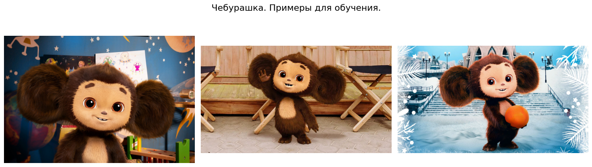
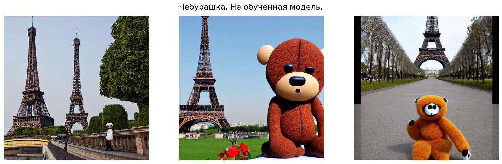
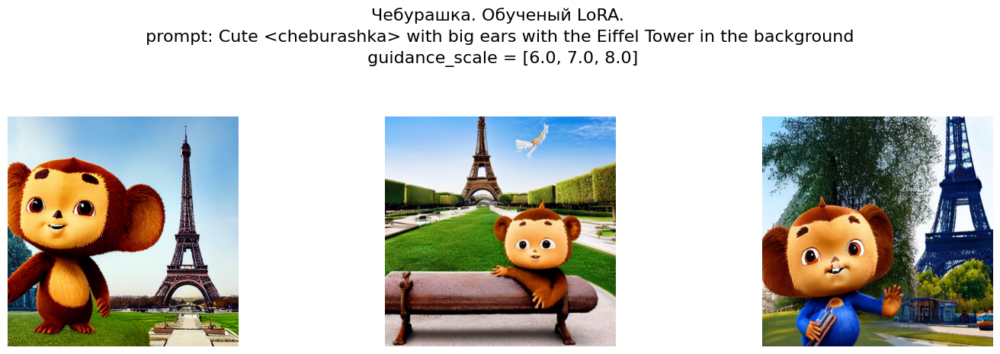
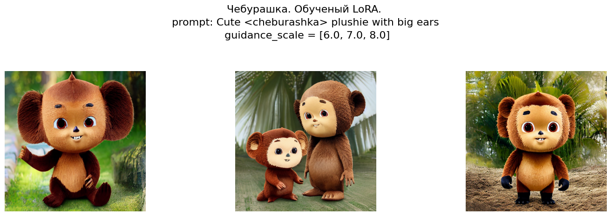
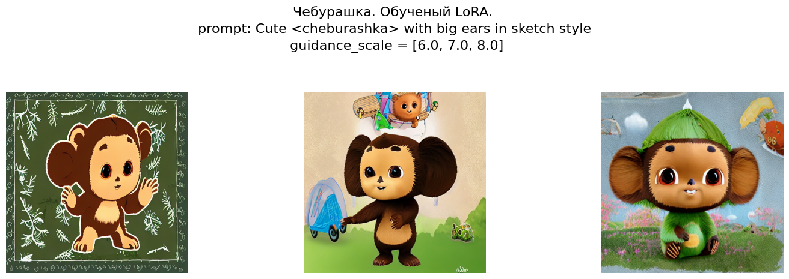
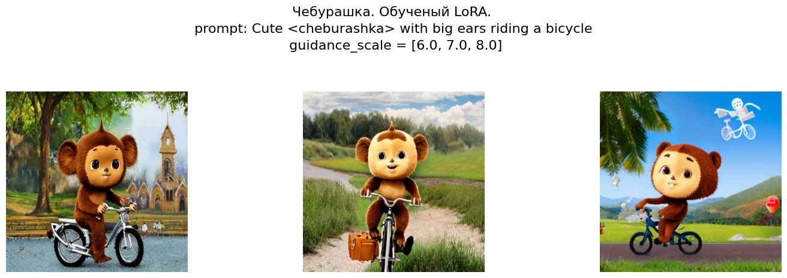

# DLE_CV_project_generation

Проекте направлен на дообучении диффузионной модели для создания неизвестного ранее ей образа на примере чебурашки. При этом у нас будет всего лишь 3 изображения, этого мало для полного обучения модели но хватит, чтобы обучить LoRA (хотя мы дополнительно поищем изображения в интернете, чтобы хоть как-то расширить наш датасет).

## Структура проекта.
Проект имеет следующую структуру:

├── project.ipynb         **Ноутбук с EDA и обучением моделей**  
├── utilits/              **Папка с .py вспомогательными скриптами и классами**  
├── artifacts/            **Артефакты в виде картинок, в том числе до и после обучения модели**  

## Подготовка к запуску.
Установите окружение:

```bash
python -m venv .venv
```

Активируйте среду. 

Установите требуемые зависимости:

```bash
pip install -r requirements.txt
```

## Этапы работы
### Работа с данными и демонстрация работы сырой модели

Как отмечалось ранее у нас было не так много изображений. Они взяты из одноимённого фильма и выглядят следующим образом:



Перед началом обучения мы удостоверились, что модель не знает, кто такой чебурашка, и сделали инференс на сырой модели.



Как видим модель понимает, что чебурашка, вероятнее всего это какое-то существо, но не понимает какое именно.

### Дообучение модели
При дообучении модели использовали LoRA, был подобран ранг модели, количество итераций и коэффициент весов при инференсе. В результате мы смогли получить следующие изображения с разными промптами и guidance_scale:









Как видим на генерацию модели влияет не только то, как мы обучали модель, но и параметры диффузионной модели в процессе генерации.