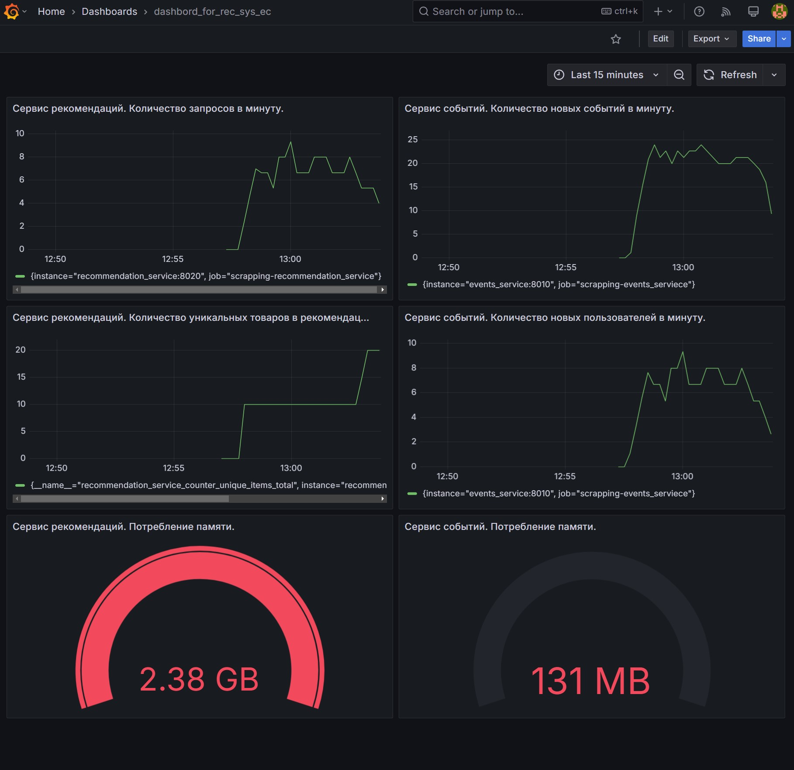
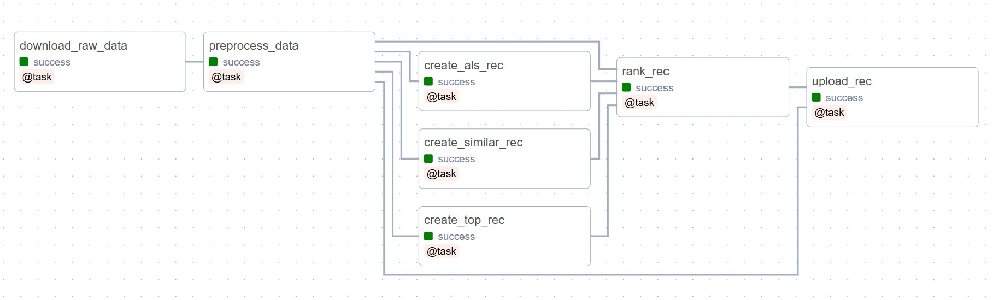

# Рекомендация товаров в электронной коммерции

В данном проекте рассмотрено создание полноценной рекомендательной системы для товаров на основе истории взаимодействия пользователей с товарами. При выполнении проекта шены следующие задачи:

1. Проведено исследование данных и предложены различные алгоритмы создания рекомендаций. в ходе исследования производилось логирование и артефактов с использованием MLflow.
2. Разработано приложение с API интерфесом и обёрнуто в Docker контейнер. Так же создана система мониторинга состояния приложения.
3. Создан даг Airflow, который в автоматическом режиме забирает данные из S3, предобрабатывает их, проверяет изменились ли данные, и если изменились, то обновляет рекомендации в S3.

## Описание структуры проекта

- **Скрипты для запуска, зависимости и переменные среды**. В корне проекта расположены баш скрипты *.sh для запуска сервисов, там же расположен файл requirements.txt с основными зависимостями и файлы .env (с переменными среды для локального запуска) и not-dev.env для запуска рекомендательного сервиса и системы мониторинга в докере.

- **notebooks**. В данной папке расположен ноутбук с основным исследованием, в котором проводится изучение выбор метрик и создание рекомендаций.

- **service**. Здесь расположен сервис рекомендаций с API интерфесом реализованном на FastAPI.

- **airflow**. В данной директории расположены файлы необходимые для поднятия Airflow в докере и даг для автоматического обновлени рекомендаций 

Рассмотрим каждый из пункотв более подробно.

## Скрипты для запуска, зависимости и переменные среды

Начнём с **переменных среды**. Как отмечалось выше в проекте используется два файла с переменными:
- *.env* - В нём указываются перемнные для локального запуска сервиса без использования докера, а также переменные для MLflow и Airflow.
- *not-dev.env* - Файл для использования сервиса в продакшн среде в виде докер контейнера.

Все **зависимости**, необходимые для проекта указаны в файле requirements.txt. Для установки зависимостей необходимо воспользоваться командой:

```bash
pip install -r requirements.txt
```

Для упрощения запуска сервисов были добавлены **скрипты**:
- run_mlflow.sh - скрипт для запуска MLflow;
- run_service.sh - скрипт для локального запуска сервиса рекомендаций;
- run_docker_services.sh - скрипт для запуска сервиса рекомендаций в Docker контейнере;
- run_airflow.sh - скрипт для иницаилизации и запуска Airflow.

## notebooks

Как отмечалось выше в данной директории расположен ноутбук с основным исследованием. В ходе исследования проводилос логирование результатов в MLflow. Для его запуска необходимо воспользоваться следующим скриптом:

``` bash
sh run_mlflow.sh 
```

Сам ноутбук разделен на следующие части:

- **EDA** - Анализ сырых данных, изучение закономерностей и аномалий. В ходе анализа было выявлено, что у нас мало таргетных действий (добавлений в корзину), при этом есть аномальные пользователи с очень большим количеством действий. Кроме того были проанализированы свойства товаров, было обнаружено, что многие свойства имеют либо много пропусков либо уникальны для каждого товара, в связи с этим были выбраны наиболее подходящие для дальнейшего анализа.
- **Preprocessing** - Предобработка данных и сохранение полученных результатов. БЫли почищены данные в соответствии с результатами EDA. Данные были сохранены для возможности возобновления исследования с данной точки.
- **Modeling** - Создание модели рекомендательной системы. Созданы функции для получения метрик, в качестве которых были выбраны точность, полнота, покрытие, новизна. Созданы рекомендации при помощи модели ALS из библиотеки implict, ТОП-100 популярных товаров, рекомендации схожих товаров, а также ранжирующая модель. Для ранжирующе модели создан датасет на основании косинусного растояния от средних товаров которые пользователь покупал, добавлял в корзину, смотрел до рекомендаций ALS и ТОП-100. Вторая часть датасета состояла из последних действий пользователя с самим товаром, его категорией и родительской категорией. Это позволило улучшить большинство метрик кроме покрытия товаров, оно немного подсело по сравнению с рекомендациями ALS.

## service

В данном каталоге расположены файлы для работы сервиса рекомендаций. Сервис написан на FastAPI. Cам сервис состоит из двух частей:

- **events_service** - Сервис регистрации действий пользователя, учитывает с какими товарами взаимодействовал пользователь, чтобы в дальнейшем отдавать данную информацию сервису рекомендаций.

- **recommendation_service** - Сервис рекомендаций, при старте забирает актуальные версии рекомендаций S3, в ходе работы позволяет получить по отдельным эндпоинтам онлайн и офлайн рекомендации для конкретного пользователя, а также объединёный список данных рекомендаций.

### Локальный запуск

Локально запустить сервис можно при помощи команды:

``` bash
sh run_service.sh
```

При таком запуске оба сревиса поднимутся непосредстве на текущем компьютере и будут использованы переменные из файла .env. Данный запуск рекомендуется для отладки работы сревисов.

Для тестирования работы сервисов предусмотрен скрипт request_test.py расположенный в папке service. Запустить его можно при помощи команды:

``` bash
python service/request_test.py
```

В ответ вернётся список онлйн, офлайн и общих рекомендаций для двух пользователей один будет с историей добавления товаров в корзину, а второй новый.

### Запуск при помощи Docker

В папке с каждым сервисом хранится Dockerfile и файл с зависимосстями, необходимые для работы данного сервиса. В корневой папке проекта расположен файл docker-compose.yml, который отвечает за запуск всех требуемых сервисов (в том числе и для мониторинга сайта). При этом переменные для запуск и работы с контейнером вынесены в файл not-dev.env это позволяет использовать одни и те же файлы сервисов и обеспечивать их взаимодействие как в докере, так и без него. Однако, при запуске docker-compose.yml по умолчанию вытягивает значения из .env файла, поэтому для его запуска рекомендуем воспользоваться следующей командой (она автоматически экспортирует нужные переменные и запустит докер): 

``` bash
sh run_docker_services.sh
```

В файле docker-compose.yml при необходимости можно поменять внутренние и внешние порты для каждого из сервисов.

### Система мониторинга состояния сервиса

При запуске сервиса при помощи докера вместе с ним поднимется система мониторинга состояния сервиса состоящая из:

- **prometheus** - собирает стандартные метрики, плюс дополнительные для каждого из сервисов;
- **grafana** - обеспечивает возможно удобной визуализации метрик (логин и пароль для доступа к grafana так же можно задать в not-dev.env).

Рассмотрим дашборд созданный для мониторинга сервисов.



Дашборд можно разделить на две части: левая - отвечает за метрики сервиса рекомендаций и правая - отвечает за сервис регистрации действий пользователя. Также в каждом горизонтальном ряду приведены схожие метрики для обоих сервисов. Продёмся по ним:

- Первый ряд (Количество запросов в минуту для сервиса рекомендаций и Количество новых событий в минуту для сервиса событий) - показывают реальную нагрузку на каждый из сервисов;
- Второй ряд (количество уникальных товаров и Количество новых пользователей в минуту) - первый график позволяет мониторить качество прогноза (не стала ли система выдавать всем одни и те же рекомендации и не стоит ли обновить сами рекомендации по всежим данным), при этом смотреть его лучше вместе со вторым, поскольку у нас может быть наплыв "холодных" пользователей и естественно они будут получать одни и те же рекомендации, так ка у них ещё нет истории. 
- Третий ряд (Потребление памяти) - позволяет мониторить объём памяти, который потребляет сервис.

## airflow

Перед запуском Airflow необходимо получить AIRFLOW_UID для этого выполнить команду:

``` bash
echo -e "\nAIRFLOW_UID=$(id -u)" 
```
И вставить полученное значение в файл .env.

Инициализацию Airflow и первичный запуск модно произвести при помощи комнды.

```bash
sh run_airflow.sh
```

Airflow поднимется на порту 8080, логин и пароль по умолчанию airflow. Дальнейшие запуски можно производить непосредственно из папки airflow и поднимать docker-compose

Для обеспечения корректной работы скрипта данного проекта в файле .env необходимо указать TEL_TOKEN - токен телеграм бота и TEL_CHAT_ID - id чата в который будет писать телеграм бот. Также в самом Airflow необходимо будет задать переменные для подключения к S3, для этого перейти в раздел Admin -> Variable и указать неоходимые переменные (S3_BUCKET_NAME, AWS_ACCESS_KEY_ID, AWS_SECRET_ACCESS_KEY).

Непосредственно даг для обновления рекомендаций лешжит в директории airflow/dags. В подпакпе utils лежат классы реализующие основную логику обработки данных и получения рекомендаций. В папке airflow/plagins/telegram_sender лежит плагин для отправки сообщений об успешном или некспешном завершении дага.

Сам даг имеет следующую структуру:


Рассмотрим каждую таску отдельно:

- **download_raw_data** - скачивает сырые данные с S3 и сохраняет их локально.
- **preprocess_data** - производит предобработку файлов, сортирует их в нужном порядке и сравнивает новые данные events с уже существующими. Если появились новые события, то передаёт дальше по дагу флаг True, показывающий, что нужно обновить рекомендации. А также сохраняет обраобтанные файлы.
- **create_als_rec** - если получает информацию, о том, что данные обновились формирует рекомендации при помощи ALS и сохраняет их.
- **create_similar_rec** - если получает информацию, о том, что данные обновились формирует рекомендации похожих объектов и сохраняет их.
- **create_top_rec** - если получает информацию, о том, что данные обновились формирует рекомендации ТОП-100 популярных товаров и сохраняет их.
- **rank_rec** - если получает информацию, о том, что данные обновились формирует датасет для обучения ранжирующей модели, обучает модель, производит ранжирование и сохраняет их.
- **download_raw_data** - если получает информацию, о том, что данные обновились загружает новые рекомендации в S3.
