# DLE_CV_project_segmentation 

Проект направлен на исследование возможности современных моделей семантической сегментации на примере задачи по сегментации кошек и собак на изображении. В ходе проекта был проведён ряд исследований направленный на выбор лучшей архитектура сети, аугментации, методики обучения для данной задачи

## Структура проекта.
Проект имеет следующую структуру:

├── project.ipynb          **Ноутбук с EDA и обучением моделей**  
├── src/                   **Папка с .py вспомогательными скриптами и классами**  
├── mmsegmentation/        **Подмодуль mmsegmentation (необходимоустановить его из официального репозитория)**  
├── datasets/              **Датасеты с первоначальной раметкой (не добавлены в репозиторий, чтобы не занимать место)**  
├── artifacts/             **Артефакты**  
│   ├── experiments/       **Логи проведённых экспериментов**  
│   ├── graph_.../         **Папки с префикосм graph_ содержат графики для групп экспериментов**  
│   ├── inference/         **Примеры Инференса лучшей модели на тестовом датасете**  
│   │   ├── masks/         **Предсказанные маски**  
│   │   ├── img_mask/      **Сами изображения с масками**   
├── files_for_replace/     **Папка с изменениями, которые необходимо скопировать в mmsegmentation (файлы с префиксом best_ относятся к финальной модели)**  

## Подготовка к запуску.
Установите окружение:

```bash
python -m venv .venv
```

Активируйте среду. 

Установите требуемые зависимости:

```bash
pip install -r requirements.txt
```

Установите mmcv при поомщи **mim**:

```bash
mim install mmcv==2.1.0
```

```bash
git clone -b main https://github.com/open-mmlab/mmsegmentation.git
cd mmsegmentation
pip install -v -e .
```

Окружение готово к запуску. Теперь необходимо скоипровать все файлы из files_for_replace/mmsegmentation в появившуюся папку mmsegmentation. Тут содержатся все изменения и файлы необходимые для запуска.

## Этапы работы
### EDA
На данном этапе был проведён анализ данных, проведена их верификация и визуализация разметки. Подробно с данным этапом можно ознакомится в project.ipynb. На основании данного этапа были сделаны следующие выводы:


1. Все три датасета (train, test, valid) сбалансированны и имеют равное количество объектов обоих классов.
2. Судя по случайно выбранным изображениям маски размечены корректно.
3. У нас для всех масок есть соответствующие изображения и для всех изображений есть соответствующие маски.
4. На каждом изоражении у нас присутсвует только объект одного класса и бэкграунд.
5. В среднем объекты обоих класов занимают примерно 10% от общей площади ихображения, но есть и более мелкие объекты в разметке. При этом плащадь, которые занимают кошки немного больше площади собак.

Учитывая специфику датасета (У нас в основном средние, иногда мелкие объекты). Попробуем обучить Unet и DeepLabv3, подберём аугментации и посмотрим, какая из сеток справится лучше.


### Формирование и проверка первичных гипотез
На данном этапе были формулированы гипотезы какие модели и как обучать, использовать ли аугментацию при обучении. Поскольку это были стартовые гипотезы, то мы делали всего 70 эпох обучения и получилис следующие результаты:

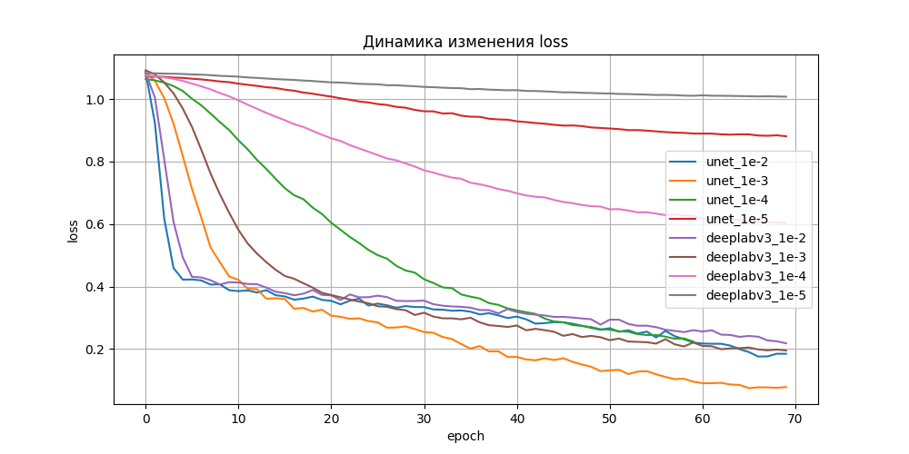
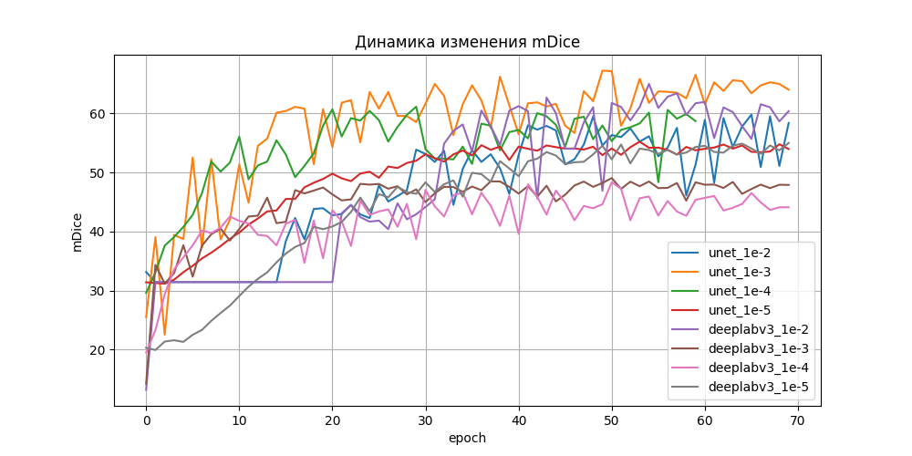

Как видим для модели на базе unet с lr=1e-3 и лос уменьшается лучше всего иметрика достигает максимальных значений. при этом обучение явно ещё не вышло на плато.

Аналогичные графики для моделей с аугментацией и без представлены ниже:

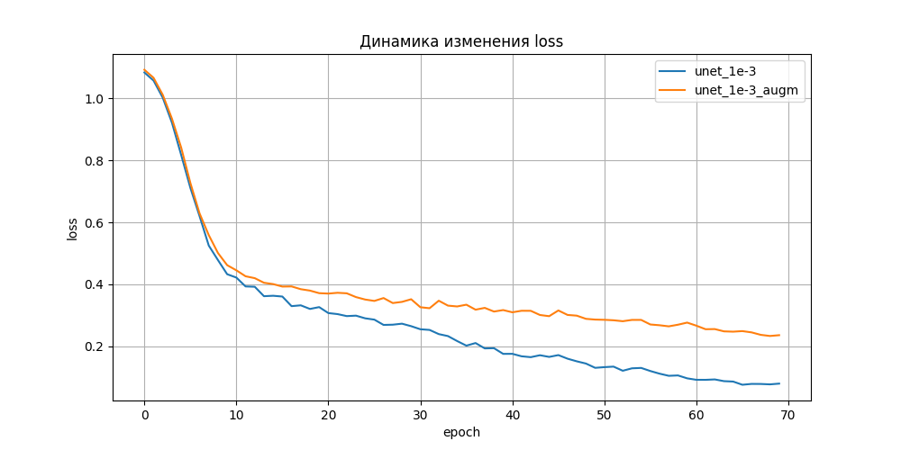
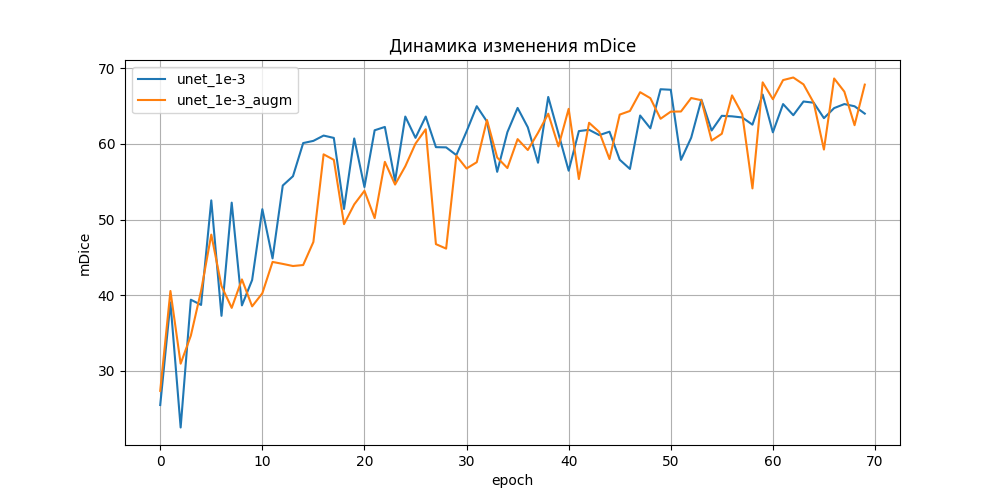

Скорость снижения лосса при аугментации немного снизилась, однако модель достигает более высоких значений метрики mDice, чем без аугментации.

## Эксперименты по улучшению качества
На данном этапе мы увеличили количество эпох для обучения, а этак же провели эксперименты с разной степенью аугментации. Графики влияния степени аугментации представлены ниже:

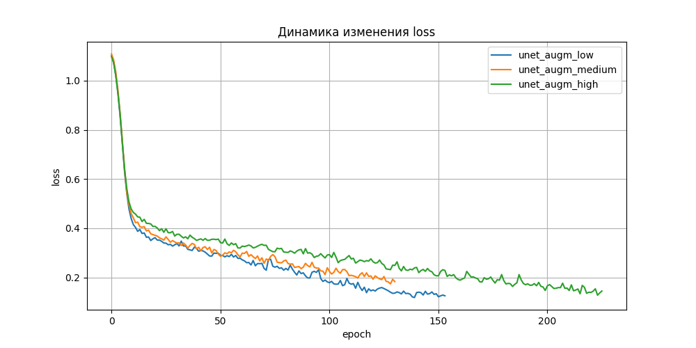
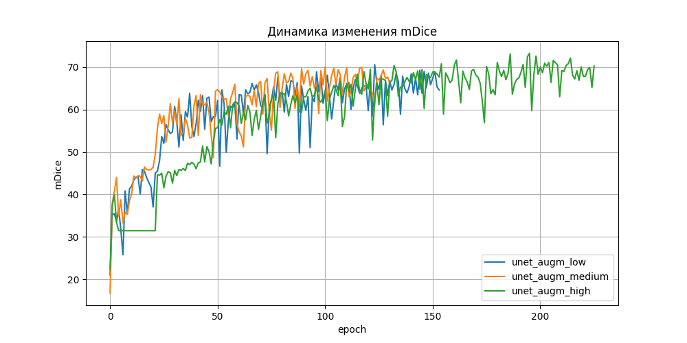

Как видно сильные аугментации позволяют получить модель более высокого качества (мы достигли более высокого значения метрики), при этом иногда в ходе обучения у нас наблюдаются  сильные просадки, вероятнее всего это связано с большим количеством случайных вырезов, но без них модель не достигает того же уровня качества, так что оставим их.

На следующем этапе мы добавили Non-rigid трансформации и получилиси следующие результаты:
- эластичная трансформация позволяет достигнуть немного более высокой метрики mDice, хотя немного и замедляет обучение в самом начале.
-  искажение сетки и оптические искажени не дали прироста в качестве модели.

После экспериментов модель была переобчуена с оптимальными аугментациями и гиперпараметрами. Графики лоссов и метрик представлены ниже:

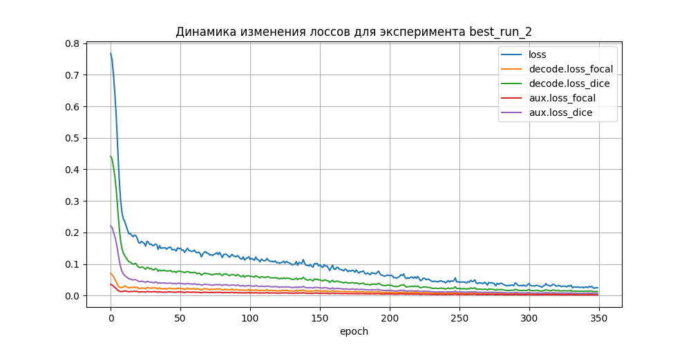
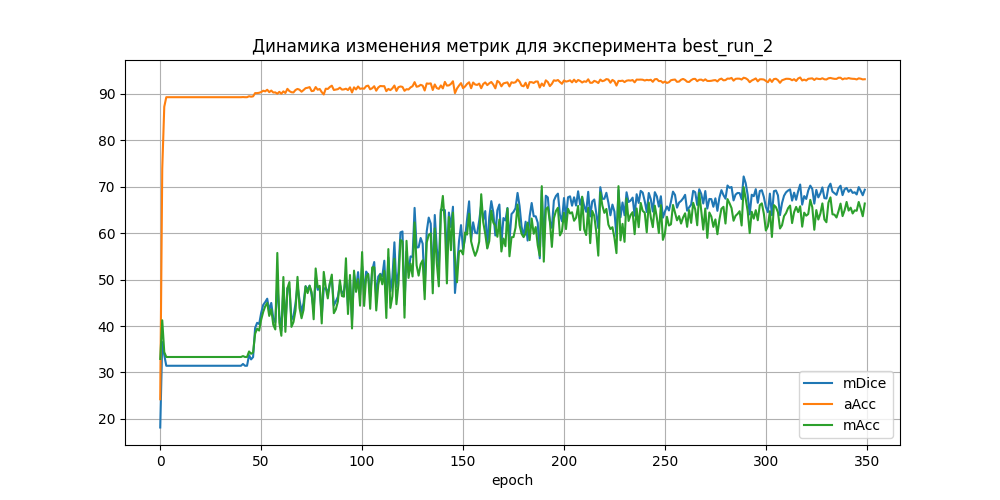

## Инференс

В заключении нами был проведён инференс на тестовом датасете и значение метрики mDice на нём было равно 72.2.

Ниже приведены примеры относительно удачных прогнозов:

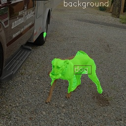
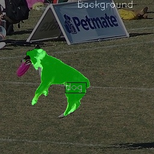

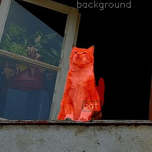
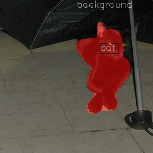

Однако также есть примеры неудачных инференсов:

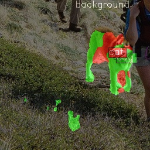
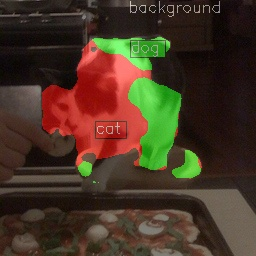

